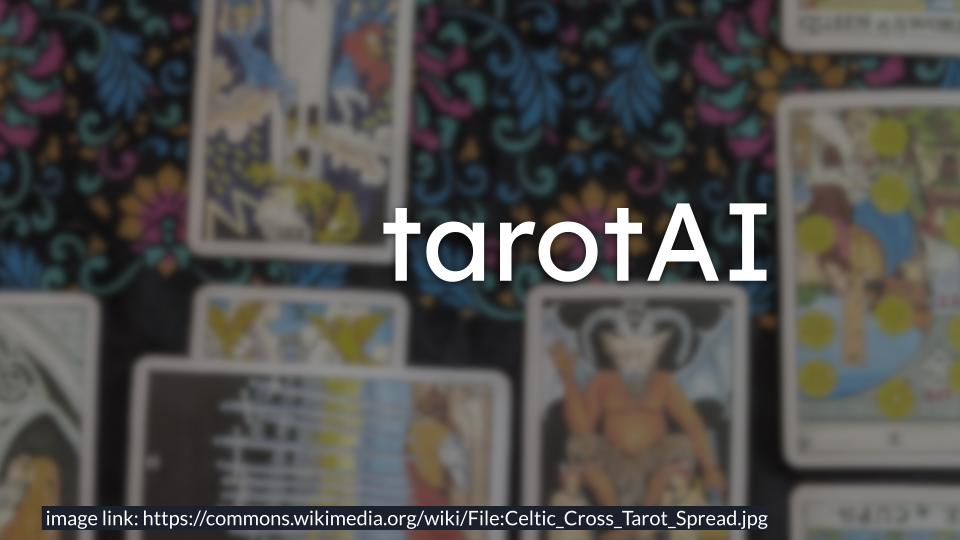
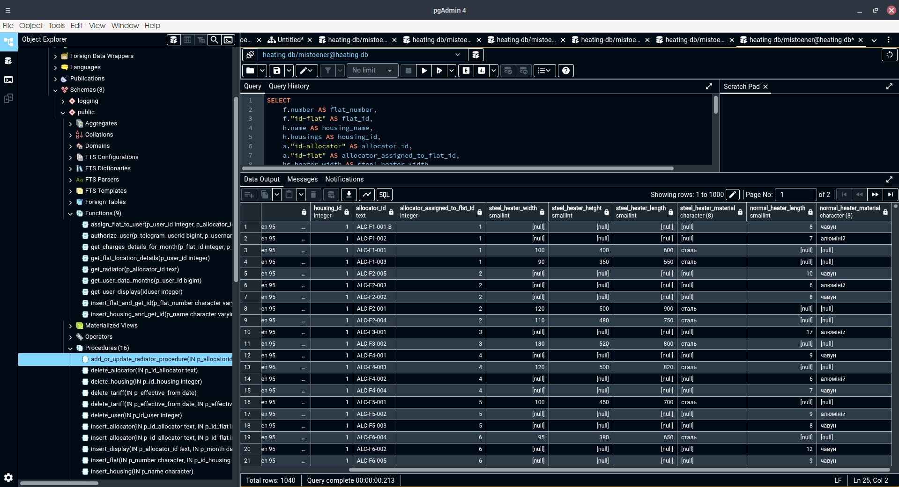
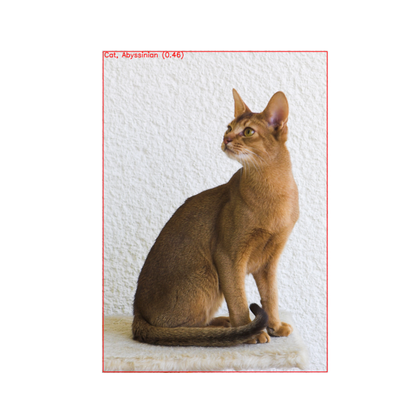

[//]: # (content.md)

# About Me
Hello! My name is [Ivan Politykin](https://www.linkedin.com/in/ivan-politykin "My Linkedin") I am a [System Analysis](https://iasa.kpi.ua/ "Official IASA Website") student at [NTUU KPI](https://kpi.ua/ "Official KPI Website") with hands-on experience building `ML models` and `deploying data-driven applications`. I am proficient in `Python` and `PostgreSQL`. I am passionate about clean code and efficient data workflows.

# Education
I am a student at [NTUU KPI](https://kpi.ua/ "Official KPI Website"), pursuing a Bachelor of Science in [System Analysis](https://iasa.kpi.ua/ "Official IASA Website") from 2022 to 2026. My relevant coursework includes `Data Structures`, `Algorithms`, `ML`, and `Database Systems`. I also completed the `EPAM Data data engineering training program` in 2024.

# My Skills
- `Programming languages:` Python, C++, C
- `Web Development:` HTML, CSS, javaScript
- `Machine Learning:` TensorFlow, scikit-learn, Pandas, NumPy, and Matplotlib
- `Miscellaneous:` Apache Airflow, Git, Linux, LLM API, and Excel
- `Math:` Probability theory, Mathematical statistics, Linear algebra, Mathematical analysis, Discrete math

# Experience
From 2024 to 2025, I worked as a `Data engineer` and `Database administrator`. I worked with `Python`, `PostgreSQL`, and `Linux server`. I designed and deployed a full-stack data management system with a `PostgreSQL` database and `Python` applications

# Projects

  

    <a href="https://github.com/Ivapol2005/tarotAI" rel="noopener" target="_blank">
      

        
      

      

        
TarotAI: Open-Source Tarot Readings Powered by LLM. Contribute to the development by creating an account on GitHub.

      

    </a>
  

  

    <a href="https://t.me/MistoEnergy_UserBot" rel="noopener" target="_blank">
      

        
      

      

        
scalable database system for managing individual apartment heating consumption

      

    </a>
  

  

    <a href="https://github.com/Ivapol2005/ANIMAL-Classification" rel="noopener" target="_blank">
      

        
      

      

        
A convolutional neural network (CNN) to classify cat and dog breeds with 91% accuracy.

      

    </a>
  

## CNN Animal Breed Classifier
 - I built a `convolutional neural network (CNN)` to classify cat and dog breeds with 91% accuracy.
 - The model was trained on over 5,000 labeled images using a custom `CNN` architecture with `data augmentation` techniques.
 - I used `Python` and `TensorFlow` for this project

<!--The project is available on [GitHub](https://github.com/Ivapol2005/ANIMAL-Classification "ANIMAL-Classification").-->

## Heating value database
 - I designed and implemented a scalable `PostgreSQL` database system for managing individual apartment heating consumption
 - I integrated `indexing`, `normalization`, and `schema optimization` to support fast queries and large-scale data growth
 - I also developed `user-friendly tools` for `data entry`, `monitoring`, and `analytics` using `SQL` and `Python`

This project used `PostgreSQL` and `Python`

made `Telegram bot` as part of this project using `Python` and `PostgreSQL` to enable residents to quickly access their monthly heating value information

You can test [the bot](https://t.me/MistoEnergy_UserBot "Telegram bot") with serial numbers `ALC-F1-001`, `ALC-F8-001`, `ALC-F10-001`, or `ALC-F12-002`

# Contacts
Tou can find me on
- [GitHub](https://github.com/Ivapol2005 "My Github")
- [Linkedin](https://www.linkedin.com/in/ivan-politykin "My Linkedin")
- [Telegram](https://t.me/gormj "My Telegram")

# Favourite Songs
<iframe data-testid="embed-iframe" style="border-radius:12px" src="https://open.spotify.com/embed/track/4UvcIxaBqIVlljqqncrpyr?utm_source=generator" width="100%" height="152" frameBorder="0" allowfullscreen="" allow="autoplay; clipboard-write; encrypted-media; fullscreen; picture-in-picture" loading="lazy"></iframe>
<iframe data-testid="embed-iframe" style="border-radius:12px" src="https://open.spotify.com/embed/track/4fpxnJGDWFxjGvLJOqPPt8?utm_source=generator" width="100%" height="152" frameBorder="0" allowfullscreen="" allow="autoplay; clipboard-write; encrypted-media; fullscreen; picture-in-picture" loading="lazy"></iframe>
<iframe data-testid="embed-iframe" style="border-radius:12px" src="https://open.spotify.com/embed/track/19wyEOwk4PTvfhBxSoZ34a?utm_source=generator" width="100%" height="152" frameBorder="0" allowfullscreen="" allow="autoplay; clipboard-write; encrypted-media; fullscreen; picture-in-picture" loading="lazy"></iframe>
